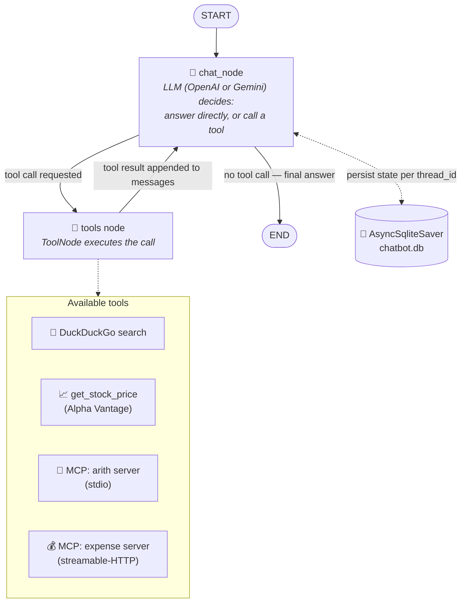

# 🤖 Nexus: LangGraph-Powered MCP Agent

A tool-using, multi-turn chatbot built with **LangGraph**, **Streamlit**, and the **Model Context Protocol (MCP)**. It can search the web, fetch live stock prices, call remote/local MCP tool servers, stream responses token-by-token, and persist every conversation to disk so you can pick up any chat thread later.

---

## ✨ Features

- 🧠 **LangGraph-orchestrated agent loop** — a single `chat_node` decides whether to answer directly or call a tool, looping until it has a final answer.
- 🔌 **MCP tool integration** — connects to any number of [Model Context Protocol](https://modelcontextprotocol.io/) servers (stdio or streamable-HTTP) via `langchain-mcp-adapters`, so new tools can be plugged in without touching the graph.
- 🔎 **Built-in tools** — DuckDuckGo web search and an Alpha Vantage stock-price lookup, in addition to whatever MCP servers you configure.
- 💬 **Streaming UI** — assistant tokens stream live into the Streamlit chat window; tool calls surface as a live "🔧 Using `tool_name` …" status widget.
- 💾 **Persistent conversations** — an `AsyncSqliteSaver` checkpointer stores full message history per thread in SQLite, so past chats survive restarts and are browsable from the sidebar.
- 🔀 **Swappable LLM backend** — flip between OpenAI and Google **Gemini 2.5 Flash** with one environment variable, no code changes.
- 🧵 **Sync/async bridge** — a dedicated background asyncio event loop lets the synchronous Streamlit runtime drive LangGraph's async streaming and checkpointing APIs safely.

---

## 🗂️ Project structure

```
chatbot-in-langgraph/
├── backend/                    # LangGraph agent — all non-UI logic
│   ├── __init__.py             #   public surface: chatbot, retrieve_all_threads, submit_async_task
│   ├── config.py                #   env-driven configuration (single source of truth)
│   ├── async_runtime.py          #   background asyncio loop bridging sync Streamlit <-> async LangGraph
│   ├── llm.py                     #   LLM provider selection (OpenAI / Gemini)
│   ├── tools.py                    #   search + stock-price tools, MCP client & tool loading
│   ├── state.py                     #   ChatState (TypedDict) — the graph's message schema
│   ├── checkpointer.py               #   SQLite checkpointer setup + thread listing
│   └── graph.py                       #   node functions, conditional routing, compiled graph
│
├── frontend/                   # Streamlit UI — all presentation logic
│   ├── __init__.py
│   ├── session.py               #   session-state init, thread reset/switch, history loading
│   ├── sidebar.py                #   "New Chat" button + conversation list
│   ├── chat.py                    #   message rendering + streaming turn handler
│   └── app.py                      #   wires the above into the page
│
├── streamlit_app.py            # entrypoint — `streamlit run streamlit_app.py`
├── requirements.txt
├── .env.example
│
├── iterations_files/            # earlier prototypes kept for reference only (not used by the app)
│
├── README.md
└── CLAUDE.md                   # project brief for AI coding assistants
```

**Why split this way?** `backend/` has zero Streamlit imports and zero UI concerns — it's a plain LangGraph app that could be reused behind a FastAPI server, a CLI, or a different frontend entirely. `frontend/` has zero LangGraph *construction* logic — it only imports the already-compiled `chatbot` graph and drives it. `config.py` is the single place env vars are read, so every other module stays free of `os.getenv` calls.

---

## 🔗 LangGraph flow

The agent is a small cyclic graph: the LLM node either answers directly or emits a tool call, in which case control passes to the tools node and back, until the LLM is satisfied.



**Per-turn sequence (as seen by the frontend):**

1. User submits a message in `streamlit_app.py` → `frontend/chat.py:handle_user_input`.
2. `chatbot.astream(...)` is scheduled on the background event loop (`backend/async_runtime.py`) with `stream_mode="messages"`, keyed by the session's `thread_id`.
3. `chat_node` (`backend/graph.py`) calls the LLM with the full message history.
4. If the LLM's response includes a tool call, LangGraph's `tools_condition` routes to the `tools` node, which executes it and appends a `ToolMessage` — the UI shows a live status widget for this.
5. The updated messages flow back into `chat_node`; this repeats until the LLM returns a plain answer.
6. Every state transition is checkpointed to `chatbot.db`, so switching threads in the sidebar reloads full history via `chatbot.get_state(...)`.

---

## 🚀 Getting started

### 1. Install dependencies

```bash
python -m venv venv
source venv/bin/activate    # Windows: venv\Scripts\activate
pip install -r requirements.txt
```

### 2. Configure environment

```bash
cp .env.example .env
```

Then edit `.env`:

| Variable | Purpose |
|---|---|
| `LLM_PROVIDER` | `openai` (default) or `gemini` |
| `OPENAI_API_KEY` | required when `LLM_PROVIDER=openai` |
| `GOOGLE_API_KEY` | required when `LLM_PROVIDER=gemini` |
| `GEMINI_MODEL` | defaults to `gemini-2.5-flash` |
| `CHECKPOINT_DB_PATH` | SQLite file for conversation persistence (default `chatbot.db`) |
| `ALPHA_VANTAGE_API_KEY` | powers the `get_stock_price` tool |
| `DUCKDUCKGO_REGION` | region used by the search tool (default `us-en`) |
| `MCP_ARITH_COMMAND` / `MCP_ARITH_SERVER_PATH` | local stdio MCP server for arithmetic tools |
| `MCP_EXPENSE_SERVER_URL` | remote streamable-HTTP MCP server for expense tools |

> MCP servers are optional — if a server is unreachable, `backend/tools.py` catches the error and the agent simply runs with whatever tools it could load (search + stock price at minimum).

### 3. Run the app

```bash
streamlit run streamlit_app.py
```

---

## 🔄 Switching to Gemini 2.5 Flash

Set in `.env`:

```
LLM_PROVIDER=gemini
GOOGLE_API_KEY=your_google_api_key_here
GEMINI_MODEL=gemini-2.5-flash
```

`backend/llm.py` picks the provider at startup — no other code changes needed. (This integration hasn't been end-to-end tested against a live Gemini API key; verify tool-calling behavior for your use case before relying on it in production.)

---

## 🧭 Future enhancements

- 🐳 **Containerization** — a `Dockerfile` + `docker-compose.yml` bundling the app, MCP servers, and SQLite volume for one-command deployment.
- 🗃️ **Pluggable checkpoint backends** — swap SQLite for Postgres/Redis checkpointers for multi-instance deployments.
- 👥 **Multi-user auth** — per-user thread isolation instead of a single shared `chatbot.db`.
- 🛠️ **Dynamic MCP server registry** — add/remove MCP servers from the UI at runtime instead of via env vars, with per-server health indicators.
- 📎 **File & image inputs** — extend `ChatState` to support multimodal messages (uploads, vision).
- 📊 **Observability** — LangSmith tracing dashboards and per-tool latency/cost metrics surfaced in the sidebar.
- 🧩 **More LLM providers** — Anthropic Claude, local models via Ollama, selectable per-thread rather than only via env var.
- ✂️ **Context management** — automatic summarization/trimming of long threads before they hit the LLM's context window.
- 🔁 **Retry & fallback policies** — automatic provider fallback (e.g. Gemini → OpenAI) on rate limits or outages.
- 🌐 **Deployable API layer** — expose the compiled `chatbot` graph over a FastAPI/WebSocket endpoint so non-Streamlit clients can consume it.
- 🔐 **Secrets management** — integrate a secrets manager (Vault, AWS Secrets Manager) instead of plain `.env` files for production deployments.
- 🧪 **Human-in-the-loop tool approval** — pause before executing sensitive tool calls (e.g. anything with side effects) and require explicit user confirmation.

---

## 📚 About `iterations_files/`

These are earlier, simpler prototypes built while iterating toward the final MCP-based design (plain graph, SQLite-backed graph, single-tool graph, RAG variant, and their matching Streamlit frontends). They're kept for reference/learning but are **not** imported by, or required to run, the current app.
